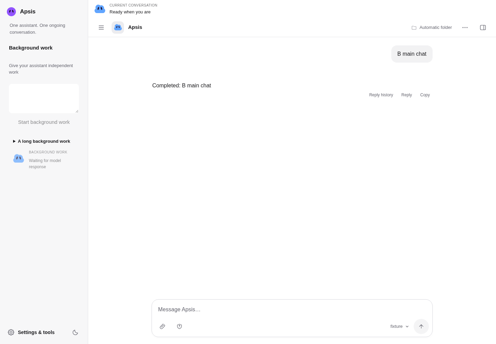

# Apsis

[繁體中文](README.zh-TW.md) · [Getting started](docs/getting-started.md) · [Documentation](docs/README.md) · [Releases](https://github.com/Suckashi/Apsis/releases)

[](https://github.com/Suckashi/Apsis/actions/workflows/test.yml) [](LICENSE)

**Apsis is a local-first personal assistant with one ongoing conversation and independent background work.**

Chat while work runs, review expandable work cards, and steer or stop a specific job. Progress, decisions and results stay visible; execution details stay collapsed. Personalize the assistant with any of the 48 original avatars.

The development branch uses a new schema-5 namespace and mandatory approval for critical or unknown effects, including in auto mode. See the [single-assistant design and limits](docs/single-assistant.md). Tagged releases below predate this redesign.



_Actual desktop UI captured with isolated demonstration data and a deterministic model fixture; this is not a live model benchmark._

## Status

**Alpha: `v0.2.0-alpha.2`.** Apsis is actively developed for local, single-owner use. Data compatibility and public APIs may change during Alpha; every release must describe breaking changes. See [known limitations and the roadmap](docs/roadmap.md) and [version and backup policy](docs/releases.md).

The runtime is **Deep Agents**. Supported model connections are OpenAI, Anthropic, Ollama and OpenAI-compatible endpoints. Model access is supplied by you; API providers may charge for requests. Deterministic tests do not certify the behavior of every model or endpoint.

## Install and start

Requires **Node.js 22.19+** and npm. Windows and Ubuntu with Node.js 22.19 are the CI baseline; macOS has not yet been verified in CI. Install Git for cloning; on Windows, Git for Windows also supplies Bash for Shell tools. Linux uses system Bash. Other tools remain available without Bash.

```sh
git clone --branch v0.2.0-alpha.2 https://github.com/Suckashi/Apsis.git
cd Apsis
npm ci
npx playwright install chromium
npm start
```

On Linux, if browser system libraries are missing, use `npx playwright install --with-deps chromium`. Browser installation is needed for browser tools; basic chat can run without it. Source ZIP downloads from the [release page](https://github.com/Suckashi/Apsis/releases) also work: extract, open a terminal in the extracted directory, and run the same npm commands. This release distributes source, not a desktop installer or an npm package.

Open <http://localhost:3100>. In **Settings & Tools → Model connections**, add a connection, run its streaming/tool-call test, and set it as the default. Open the assistant conversation, then send:

> Create `hello.md` in the current working folder with a short introduction to Apsis. Publish it as a downloadable result and tell me what you checked.

Success means you can see the file, download the published artifact, expand the operation record, and reload without losing the conversation. The [getting started guide](docs/getting-started.md) walks through this flow, configuration and troubleshooting. For development, clone the default branch and use `npm run dev` after `npm ci`.

## What you can do

| Workflow                            | Example                                                                                                   |
| ----------------------------------- | --------------------------------------------------------------------------------------------------------- |
| Work on an existing repository      | Link a working folder, ask a Bot for a focused change, then inspect files and Git differences.            |
| Turn information into a deliverable | Attach source material, ask for a report, and preview or download the published result.                   |
| Keep a Bot working regularly        | Create a schedule with a timezone, test it, and inspect each execution's result. Apsis must stay running. |

Native Deep Agents `task` handles temporary internal subagents. `start_background_work` creates durable independent work with its own session. Native `execute` is disabled; host commands use the guarded Shell tool. See [architecture](docs/architecture.md).

For static web apps, `verify_web` checks real browser interactions, including hidden items, checkbox state and state after reload. Its retry limit tracks the failed check, so a different check does not prematurely end the Bot's work.
`publish_file` bundles local assets only for an HTML entry. Omit `assets` to publish a Markdown or other single file as its own result card.

## Data and execution

Data defaults to `.apsis-v5/`, including settings, conversation databases, memory, artifacts, browser state and the default workspace. `APSIS_DATA_DIR` in an optional `.env` selects a custom directory. Existing projects linked outside this directory remain in their original locations and need their own backups.

API keys stay server-side, and configuration can reference environment variables. Provider requests still send the required task context to the configured model service; “local-first” describes application storage and hosting. Protect the data directory and its backups as private data.

Shell runs on your host. Approval and path rules are not an operating-system sandbox. Review [approval modes](docs/approval-modes.md) and the [security boundary](SECURITY.md) before connecting tools. After restart, unfinished work is marked interrupted and external actions are not automatically replayed. Stop Apsis before backing up the complete data directory; follow the [backup and restore procedure](docs/releases.md#backup-and-restore).

Shell records command output as UTF-8. Python commands launched through Shell also use UTF-8 for piped output.

This release accepts schema 5 only. Older `.apsis/` data is left untouched and is not imported automatically.

## Contribute and verify

Start with [CONTRIBUTING](CONTRIBUTING.md), the [architecture map](docs/architecture.md), and [small contribution ideas](docs/roadmap.md#contribution-entry-points). Report reproducible bugs through [Issues](https://github.com/Suckashi/Apsis/issues/new/choose); report vulnerabilities [privately](https://github.com/Suckashi/Apsis/security/advisories/new).

```sh
npm run check:docs
npm run build
npm test
npm run test:chat:browser
npm run test:bots:browser
npm run test:settings:browser
```

Browser checks use isolated stores and deterministic model fixtures. A backup/restore integration test checks a stopped store, published files and persisted conversation state. [Alpha acceptance](docs/alpha-acceptance.md) tracks the separate real-model and independent-user evidence still needed.

## License

Apsis is licensed under [Apache License 2.0](LICENSE). Vendored Kimi Bash code retains its MIT license. See [NOTICE](NOTICE) and [third-party notices](THIRD_PARTY_NOTICES.md).
