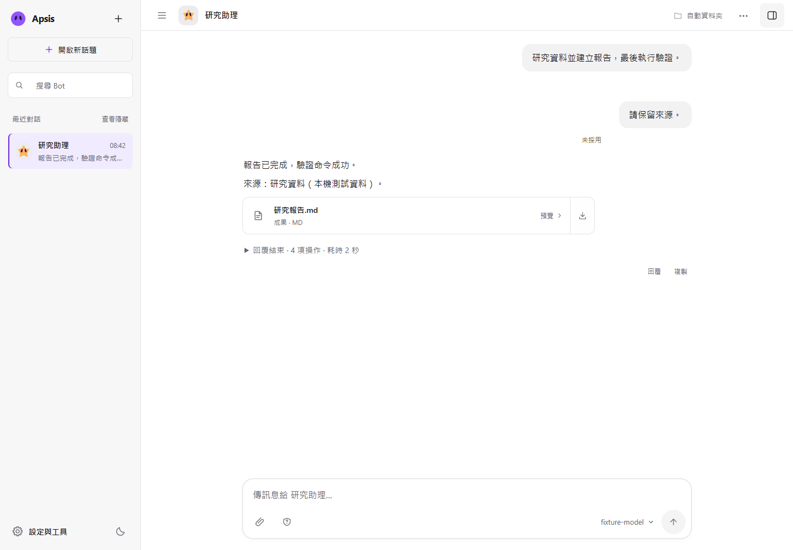

# 入門指南

[English](getting-started.md) · [文件索引](README.md)

## 1. 安裝固定版本

安裝 Node.js 22.19 以上、npm 與 Git。CI 驗證 Windows／Ubuntu 搭配 Node.js 22.19，macOS 尚未驗證。Windows 的 Shell 工具使用 Git for Windows 提供的 Bash；Linux 使用系統 Bash。

```sh
git clone --branch v0.2.0-alpha.2 https://github.com/Suckashi/Apsis.git
cd Apsis
npm ci
npx playwright install chromium
npm start
```

Linux 若缺少瀏覽器系統套件，使用 `npx playwright install --with-deps chromium`，可能需要管理員權限。基本聊天不需要瀏覽器或 Bash。也可下載版本頁的原始碼 ZIP，解壓縮後執行相同 npm 指令。請保留開發依賴；目前從原始碼啟動時需要建置介面及檢查 TypeScript。

等終端顯示網址後開啟 <http://localhost:3100>。停止時按 Ctrl+C，確認程序結束後才能複製資料做完整備份。

## 2. 連接模型

開啟「設定與工具 → 模型連線」，新增供應商並填入該服務可用的模型 ID、API key 與 API URL。使用「測試」確認串流與工具呼叫，再設為預設。HTTP 連線成功不代表模型能使用工具。

Ollama 需另外啟動服務並安裝支援工具的模型；URL 使用 `http://127.0.0.1:11434`，模型 ID 與已安裝名稱完全相同。OpenAI 相容服務請填供應商文件指定的 Base URL。各模型能力與限制不同，Context 上限應填實際支援容量，不能假設應用程式預設值一定適合。

API 服務可能按請求計費。憑證留在伺服器，但回答所需的任務背景會傳送到所選供應商。詳見[安全範圍](../SECURITY.md)與[設定檔](config-files-design.md)。

## 3. 完成第一個任務

選取初始 Bot，或建立一位並設定名稱、角色及模型。傳送：

> 請在目前工作資料夾建立 `hello.md`，寫一小段 Apsis 的介紹，發布成可下載成果，最後簡短說明你檢查了什麼。

遇到核准請求時，閱讀操作再決定。詳細工具紀錄可展開查看，第一個任務先使用自動分配的工作資料夾。

確認四個結果：

1. 最後回覆能說明成果，沒有把未驗證事項說成完成。
2. 「檔案」面板找得到 `hello.md`，內容可讀。
3. 已發布成果可下載，內容與檔案一致。
4. 重新整理後，對話與成果仍在。



_畫面採用隔離示範資料與固定模型替身。真實模型可能需要補充指示才能正確寫檔與發布。_

執行中再傳訊息可補充指示，收據會說明是否採用。停止不會撤銷已完成的修改。「開啟新話題」切換工作背景，舊歷史仍保留。

## 4. 試用代表性工作

- **既有專案：**開啟新話題，從聊天選項連結可丟棄的專案副本，交辦一項小修改，查看差異與驗證。
- **資料整理：**附上不含私人資訊的資料，要求含來源的報告，再預覽與下載。
- **排程：**建立含時區的簡單工作，先試跑，查看結果，測完暫停。Apsis 必須持續執行，恢復時可能補執行一次。

使用 [Alpha 驗收](alpha-acceptance.md)記錄真實供應商與多日使用，與固定模型測試分開。

## 資料位置與設定

預設資料目錄為 `.apsis-v4/`，預設工作檔案位於 `.apsis-v4/workspace/`。可用編輯器將 `.env.example` 複製為 `.env`，設定：

```dotenv
PORT=3100
# 建議使用絕對路徑，讓資料與原始碼目錄分開。
# APSIS_DATA_DIR=/absolute/path/to/apsis-data
```

Windows 可使用 `D:/ApsisData`，Linux 可使用 `/home/you/apsis-data`。移動資料目錄不會搬動外部專案、連結資料夾、共用技能或環境變數密鑰。詳見[備份與還原](releases.md#backup-and-restore)。

## 故障排除

| 問題                       | 下一步                                                                                                                 |
| -------------------------- | ---------------------------------------------------------------------------------------------------------------------- |
| npm 或 TypeScript 啟動失敗 | 執行 `node --version` 確認 22.19 以上，使用完整 `npm ci`，保留去除密鑰的終端錯誤。                                     |
| 3100 已被使用              | 停止另一個 Apsis，或在 `.env` 修改 `PORT`；重啟後開啟終端顯示的新網址。                                                |
| 模型連不上                 | 檢查服務是否啟動、模型 ID、key、URL 與供應商類型，再跑串流／工具測試；不要將密鑰貼到 Issue。                           |
| 瀏覽器工具無法啟動         | 執行 `npx playwright install chromium`；Linux 可加 `--with-deps`。可用 `APSIS_BROWSER_PATH` 指定瀏覽器執行檔。         |
| Shell 不可用               | 安裝 Git for Windows 或系統 Bash；`APSIS_SHELL_PATH` 可指定 Bash 執行檔的絕對路徑。                                    |
| 資料格式錯誤或檔案遺失     | 保留原目錄，檢查 `APSIS_DATA_DIR`、資料版本與檔案完整性；還原停止後的完整備份，不要刪除資料庫檔。本版不匯入 schema 3。 |
| 重啟後工作中斷             | 先查看對話與操作紀錄，再交辦新請求；外部操作不會自動重播或回滾。                                                       |

仍有問題時，使用[問題表單](https://github.com/Suckashi/Apsis/issues/new/choose)，附上版本／commit、作業系統、Node 版本、供應商類型與去除私人資料的最小重現步驟。
